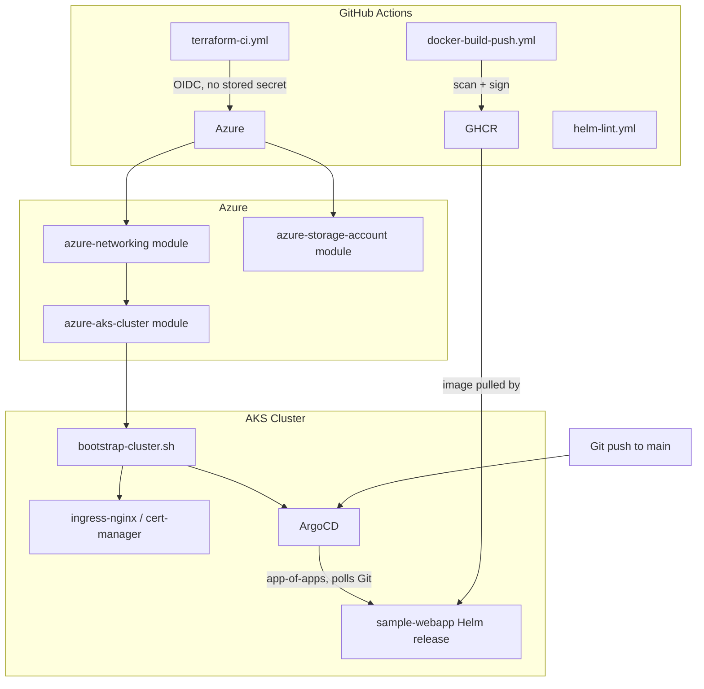

# Architecture

## End-to-end flow

## Why the boundary sits where it does

**Terraform owns everything up to and including the AKS control plane and
its bootstrap-critical dependencies' *installation surface* — it does not
own application state.** The line is deliberate: Terraform state locking
and Helm release state don't compose well in the same apply, so
`bootstrap-cluster.sh` runs once, imperatively, right after `terraform
apply`, to install the handful of components (ingress controller,
cert-manager, ArgoCD) that GitOps itself depends on. Everything after that
point — every application, every config change — is a Git commit that
ArgoCD reconciles, never a manual `kubectl apply` or `helm upgrade`.

**Identity chain**: GitHub Actions → OIDC federated credential → Azure AD
app registration scoped to a single resource group → Terraform. No
`ARM_CLIENT_SECRET` exists anywhere in this repository's history. The same
pattern repeats inside the cluster: pods that need Azure access use
Workload Identity (OIDC federation against the AKS OIDC issuer), not
mounted service-principal secrets.

## Environment promotion

Each environment (`dev`, `staging`, `prod`) is a separate Terraform root
module composing the three modules in `terraform-modules/` with its own
backend and variable values (not included in this public repo — see the
Quickstart note in the top-level README). `scheduled-drift-check.yml` runs
`terraform plan -detailed-exitcode` nightly against all three and opens a
GitHub issue if any environment has drifted from its declared state.
