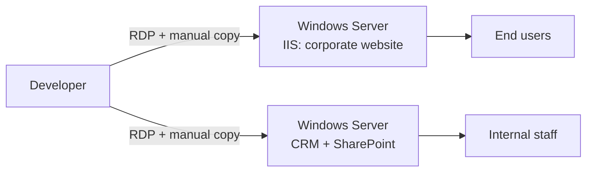
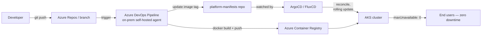

# Architecture: Before and After

## Before

Deploys were a developer RDP-ing into the production Windows Server and
manually copying updated files into `inetpub\wwwroot`. There was no build
step, no environment parity check, and no way to deploy without either
briefly taking IIS down or risking a half-copied deployment serving mixed
old/new files. Both the website and the CRM ran on servers that were also
handling rising traffic with no horizontal scaling option short of standing
up an entirely new VM by hand.

## After

A `git push` triggers the pipeline on the on-prem self-hosted agent, which
builds the container image, pushes it to ACR, and updates the image tag in
a separate manifests repo. ArgoCD/FluxCD — watching that repo — pick up the
change and reconcile the cluster: new pods must pass their readiness probe
and be serving traffic before any old pod is terminated (`maxUnavailable:
0`), so there's no window where capacity drops or users hit a
half-updated instance. See [`../gitops/README.md`](../gitops/README.md)
for why the deploy step moved from the pipeline running `kubectl apply`
directly to this git-driven reconciliation model.

## Why containers + Kubernetes over "just add a load balancer + more VMs"

The high-load problem had two parts: no ability to scale horizontally
without manual VM provisioning, and no safe way to deploy without an outage
window. A load balancer in front of more manually-managed VMs would have
solved capacity but not the deployment risk — every rollout would still be
a manual, per-VM operation multiplied by however many VMs exist. Moving to
containers on AKS solved both at once: the deployment mechanism (rolling
update) *is* the scaling mechanism (replica count), so there's one thing to
operate instead of two.

## Why this didn't require a full application rewrite

The website and CRM are IIS-hosted .NET applications. Containerizing them
with the Windows Server Core IIS base image (`docker/Dockerfile.website`)
meant the applications themselves didn't need to change — the same
`inetpub\wwwroot` content that used to be manually copied to a VM is now
`COPY`'d into an image at build time. This kept the migration scoped to
*how the app gets deployed and run*, not a framework migration, which
made it achievable without a multi-quarter rewrite project.

## Outcome

Developers now push code and the pipeline handles build, image push, and a
zero-downtime rollout automatically — no more manual RDP deployments, and
no more outage window during releases.
